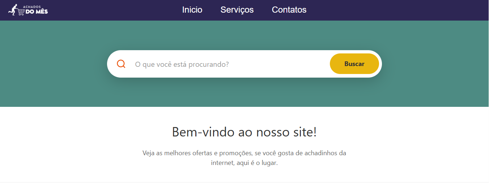
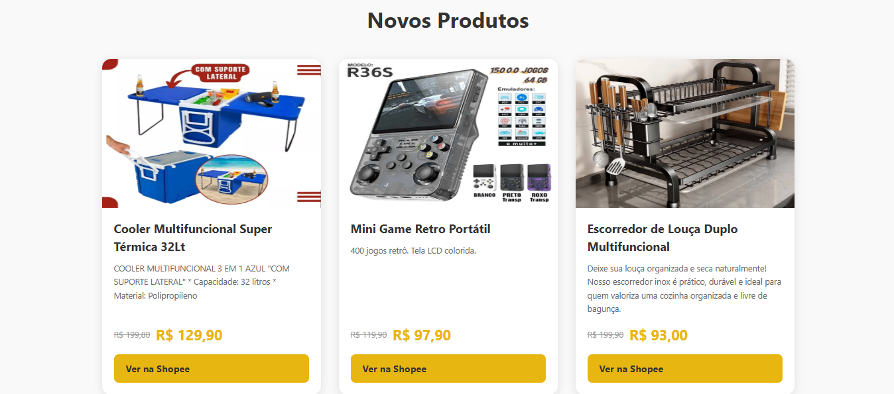

🛍️ Shopee Achados: O seu Guia de Garimpos Online
Status do Projeto: 🚀 Em produção / 🛠️ Em desenvolvimento
📖 Sobre o Projeto
O Shopee Achados é uma plataforma curada que organiza e exibe os melhores produtos, promoções e "queridinhos" da Shopee. O objetivo é facilitar a vida do usuário, filtrando produtos de qualidade, com boas avaliações e preços imperdíveis, evitando que ele se perca no mar de opções do marketplace.
________________________________________
✨ Funcionalidades Principais
•	🔍 Busca Inteligente: Filtre achados por categorias (casa, tech, moda, etc).
•	🔥 Trendings: Os produtos mais virais do TikTok e Instagram.
•	💰 Alerta de Preço: Visualização clara de descontos e cupons.
•	📱 Design Responsivo: Navegação perfeita tanto no desktop quanto no celular.
•	🔗 Links Diretos: Redirecionamento seguro para a loja oficial.
________________________________________
🛠️ Tecnologias Utilizadas
O projeto foi construído com o que há de mais moderno no desenvolvimento web:
Tecnologia	Finalidade
HTML	Frontend
CSS3	Estilização e Responsividade
PRODUTOS.JSN	Banco de dados
Lucide Icons	Pacote de ícones minimalistas
________________________________________
📸 Screenshots

   

________________________________________

🚀 Como Executar o Projeto
Clone o repositório:

Bash

git clone https://github.com/seu-usuario/shopee-achados.git
Instale as dependências:

Bash

npm install
Inicie o servidor de desenvolvimento:

Bash

npm run dev
Acesse no navegador: http://localhost:3000

🤝 Contribuições
Sugestões e melhorias são sempre bem-vindas!

Faça um Fork do projeto.

Crie uma Branch para sua feature (git checkout -b feature/nova-funcionalidade).

Dê um Commit nas suas alterações (git commit -m 'Adicionando nova funcionalidade').

Dê um Push na sua Branch (git push origin feature/nova-funcionalidade).

Abra um Pull Request.

📩 Contato
Feito com ❤️ por [Seu Nome]

LinkedIn: Seu LinkedIn

Instagram: @seu-perfil

Email: seu-email@exemplo.com